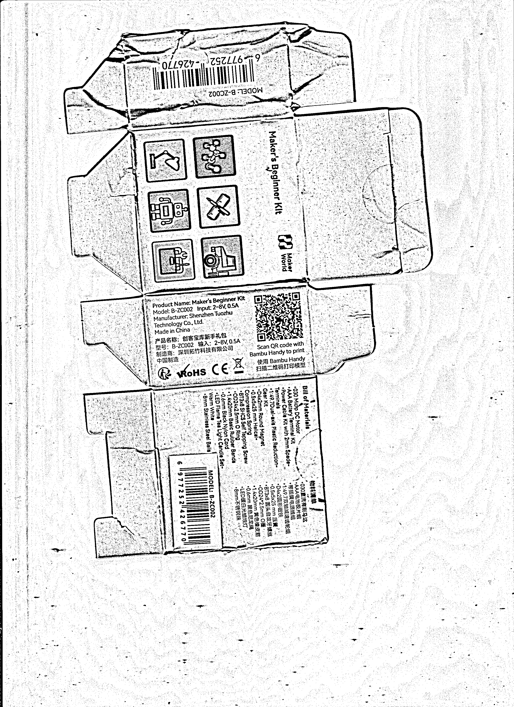

# Line-drawing-generation_1.0.0

> A desktop image-to-line-art tool developed with Python, OpenCV, and Qt (PySide6)

---

## 1. Graphical Abstract

The figure below demonstrates the core functionality of this software: converting a color image (left) into a line art version (right) using algorithmic processing.

|  |  |
| -------------------------------------------------- | --------------------------------------------------- |

---

## 2. Software Purpose

### 2.1 Development Process Type

This project adopts an **agile development process**, specifically **Scrum-style iterative development**.

### 2.2 Reasons for Choosing This Model (Waterfall vs. Agile)

| Development Model | Characteristics                                              | Reasons for Choosing Agile                                   |
| :---------------- | :----------------------------------------------------------- | :----------------------------------------------------------- |
| **Waterfall**     | Strongly sequential, fixed requirements, strict phase dependencies. Suitable for large systems with well-defined, stable requirements (e.g., aerospace, banking). | Image processing and GUI design involve exploration; parameters and effects often need frequent adjustments based on test feedback. Waterfall's rigid process limits optimization. |
| **Agile**         | Iterative, incremental, embraces change, continuous delivery. Suitable for products with evolving requirements and rapid prototyping. | 1. **Algorithmic Experimentation**: Different line art algorithms (Canny, sketch, etc.) require repeated testing – agile allows rapid integration and evaluation.<br>2. **User Experience First**: UI layout and interaction logic can be flexibly modified based on early user feedback.<br>3. **Risk Control**: Each sprint produces a runnable version, delivering usable results even if the project is interrupted. |

### 2.3 Potential Uses (Target Market)

- **Designers & Illustrators**: Quickly extract line art from photos or complex images as a draft or inspiration for further creation.
- **Education**: An auxiliary tool for art teaching ("copying" exercises) to help students understand contours and structure.
- **Content Creators**: Generate unique sketch-style covers or illustrations for videos, blogs, or social media.
- **Printing & DIY**: Convert portraits or logos into line art for T-shirt printing, heat transfers, badge making, etc.
- **Hobbyists**: An easy-to-use desktop tool that provides professional line art effects without needing Photoshop.

---

## 3. Software Development Plan

### 3.1 Development Process

Using the Scrum framework with **2-week sprints**. The typical process is as follows:

1.  **Product Backlog**: Maintain all functional requirements (e.g., "support Canny algorithm", "real-time preview").
2.  **Sprint Planning**: Select high-priority tasks from the backlog and break them down into executable user stories.
3.  **Sprint Execution**:
    - **Daily Stand-up**: Sync progress and obstacles.
    - **Continuous Integration**: Automated tests run after code commits.
4.  **Sprint Review**: Demonstrate the runnable line art conversion features and collect feedback.
5.  **Sprint Retrospective**: Review the process and improve efficiency.

### 3.2 Team (Roles & Responsibilities)

| Role                            | Responsibilities                                             | Assigned Member        |
| :------------------------------ | :----------------------------------------------------------- | :--------------------- |
| **Product Owner**               | Define feature priorities, accept deliverables, ensure alignment with target market. | Project Manager        |
| **Scrum Master**                | Maintain the development process, resolve team blockers, organize meetings. | Technical Lead         |
| **Full-Stack Developer (Core)** | - Implement all image processing algorithms (OpenCV).<br>- Build the Qt interface (PySide6).<br>- Integrate signal/slot logic, handle file I/O. | 1 Python Developer     |
| **UI/UX Advisor**               | Design interface layout, interaction prototypes, and icon resources. | 1 Designer (Part-time) |
| **Test Engineer**               | Write unit tests, execute integration tests, log bugs.       | 1 QA (Part-time)       |

### 3.3 Schedule

| Sprint Phase | Time      | Core Objective                               | Deliverables                                                 |
| :----------- | :-------- | :------------------------------------------- | :----------------------------------------------------------- |
| **Sprint 0** | Week 1    | Environment setup, technology validation     | - Configure Python+OpenCV+PySide6 environment<br>- Validate Canny algorithm display in Qt |
| **Sprint 1** | Weeks 2-3 | Implement basic conversion & UI              | - Load/save images<br>- Dropdown menu for algorithm selection<br>- Display original and result images |
| **Sprint 2** | Weeks 4-5 | Add parameter adjustment & real-time preview | - Sliders for threshold/blur control<br>- "Apply" button to update line art<br>- Status bar hints |
| **Sprint 3** | Weeks 6-7 | Algorithm optimization & post-processing     | - Add morphological operations (dilate/erode)<br>- Support inversion, denoising<br>- Optimize side-by-side comparison view |
| **Sprint 4** | Week 8    | Testing, packaging & documentation           | - Unit test coverage >80%<br>- Generate executable files (.exe/.app)<br>- Complete user manual |

### 3.4 Algorithms

The software implements three core line art extraction algorithms, which users can freely switch between:

1.  **Canny Edge Detection**
    - **Principle**: Multi-stage edge detector including Gaussian denoising, gradient calculation, non-maximum suppression, and double threshold connection.
    - **Use Case**: Clear, precise contours for industrial or design drawings.

2.  **Pencil Sketch Effect**
    - **Principle**: Grayscale inversion → Gaussian blur → Divide blend (Color Dodge) to simulate hand-drawn shading.
    - **Use Case**: Artistic creation, soft-style illustrations.

3.  **Adaptive Threshold Binarization**
    - **Principle**: Dynamically calculates a threshold based on the local neighborhood mean or Gaussian-weighted sum to extract local edges.
    - **Use Case**: Photos with uneven lighting or scanned documents.

### 3.5 Current Software Status

- **Development Stage**: All goals of **Sprint 2** have been completed.
- **Implemented Features**:
  - Support for loading and saving PNG/JPG/BMP formats.
  - All three algorithms work correctly, with key parameters adjustable via sliders.
  - Main interface with left/right panels displaying original image and line art for side-by-side comparison.
  - Complete menu bar, status bar, and About dialog.
- **Items to Optimize**:
  - Post-processing functions (dilate/erode) are not yet integrated into the UI.
  - The interface may become briefly unresponsive when converting very large images (>4K) – needs background threading.
  - Undo/redo functionality is currently missing.

### 3.6 Future Plans

- **Short-term (1-2 months)**:
  - Add a "Invert Colors" button for switching between white lines on black background / black lines on white background.
  - Add batch processing to convert entire folders at once.
  - Support exporting line art as SVG vectors (via `potrace` command-line integration).
- **Mid-term (3-6 months)**:
  - Introduce deep learning-based line art extraction models (e.g., U-Net) for a smarter "anime line art" mode.
  - Implement a history panel to revert to any adjustment step.
  - Release standalone installers for Windows, macOS, and Linux.
- **Long-term (1 year+)**:
  - Develop a web-based version (using OpenCV.js + Vue.js) requiring no installation.
  - Build a user community to share parameter presets and effect templates.

---

## 4. Additional Content

### 4.1 Demo Video (YouTube Link)
https://youtu.be/fM8EwJN3ujI?si=_NzHolWIKnRsPo7f


### 4.2 Development & Runtime Environment

#### Programming Language

- Python 3.9+

#### Minimum Hardware & Software Requirements

| Item              | Minimum Configuration                    | Recommended Configuration                  |
| :---------------- | :--------------------------------------- | :----------------------------------------- |
| Operating System  | Windows 10 / macOS 11 / Ubuntu 20.04     | Windows 11 / macOS 14 / Ubuntu 22.04       |
| Processor         | Dual-core 2.0 GHz                        | Quad-core 3.0 GHz+                         |
| Memory            | 2 GB                                     | 4 GB+                                      |
| Graphics Card     | Any OpenGL 2.0 compatible integrated GPU | Discrete GPU (to accelerate image scaling) |
| Hard Disk Space   | 200 MB (excluding sample images)         | 500 MB                                     |
| Screen Resolution | 1280×720                                 | 1920×1080 or higher                        |

#### Required Dependencies (requirements.txt)

```text
opencv-python>=4.8.0.74
numpy>=1.24.3
PySide6>=6.5.1
Pillow>=10.0.0
```

#### Installation & Execution Commands

```bash
# Create a virtual environment (recommended)
python -m venv venv
source venv/bin/activate   # Linux/macOS
venv\Scripts\activate      # Windows

# Install dependencies
pip install -r requirements.txt

# Launch the software
cd src
python main.py
```

---

## 5. Declarations

During the development of this software (Image to Line Art), the following open-source resources, third-party libraries, and reference code snippets were used. We hereby acknowledge and express our gratitude:

| Resource Name                  | Purpose                                                      | Source/License                                               | Modified?                           |
| :----------------------------- | :----------------------------------------------------------- | :----------------------------------------------------------- | :---------------------------------- |
| **OpenCV (cv2)**               | Image reading, grayscale conversion, edge detection, sketch algorithm implementation | [Apache License 2.0](https://github.com/opencv/opencv/blob/4.x/LICENSE) | No (used as a library)              |
| **PySide6 (Qt for Python)**    | Cross-platform GUI framework, main window, widgets, signal/slot mechanism | [LGPL v3](https://www.qt.io/licensing/)                      | No (used as a library)              |
| **NumPy**                      | Multidimensional array operations, supporting OpenCV image data | [BSD 3-Clause](https://github.com/numpy/numpy/blob/main/LICENSE.txt) | No                                  |
| **Pillow (PIL)**               | Auxiliary image format conversion and pixel processing in Qt | [MIT-CMU](https://github.com/python-pillow/Pillow/blob/main/LICENSE) | No                                  |
| **Pencil Sketch Core Logic**   | Inspiration for `cv2.divide(gray, 255 - blurred, scale=256.0)` from [Adobe Photoshop tutorials](https://helpx.adobe.com/photoshop/using/convert-photo-to-sketch.html) and Stack Overflow discussions | Public knowledge (algorithmic concept); actual code is original implementation | Yes (self-written)                  |
| **Project Template Structure** | Menu bar and status bar layout in `main_window.py` referenced from PySide6 official examples | [BSD 3-Clause](https://doc.qt.io/qtforpython-6/license.html) | Yes (heavily adjusted & customized) |

**Important Notes**:

- Except for the third-party libraries listed above, all image processing conversion functions (`_canny_edge`, `_pencil_sketch`, `_adaptive_threshold`), parameter mapping logic, and UI layout code were independently written.
- The project does not contain any closed-source or unlicensed code snippets.
- When distributing or modifying this software, please comply with the license terms of each dependency library, especially the requirements of LGPL v3 regarding dynamic linking.

---

**Document Version**: 1.0
**Last Updated**: March 2025
**Project Repository**: https://github.com/tiexue-ls/Line-drawing-generation_1.0.0.git

